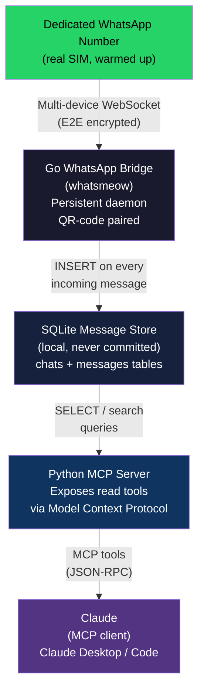

# WhatsApp Group-Observer MCP — Architecture

**Generated:** July 8, 2026

---

## System Overview

The system has four components in a linear data pipeline:

1. **WhatsApp Bridge** — Go process using whatsmeow; impersonates a linked WhatsApp Web device on the dedicated number; subscribes to all group and individual chat events
2. **SQLite Message Store** — local database; every incoming message (text, media metadata, sender, timestamp, group) written immediately; indexed for fast search
3. **MCP Server** — Python process exposing read tools over the Model Context Protocol; only queries SQLite (never touches WhatsApp directly)
4. **Claude (MCP Client)** — Claude Desktop or Claude Code; invokes MCP tools on demand to answer questions about conversations

---

## ASCII Diagram

```
+------------------------------------------+
|  Dedicated WhatsApp Number (real SIM)    |
|  Warm up 3-4 weeks; join groups manually |
+------------------------------------------+
                    |
                    | WhatsApp Multi-Device Protocol
                    | (WebSocket, end-to-end encrypted)
                    v
+------------------------------------------+
|       Go WhatsApp Bridge (whatsmeow)     |
|                                          |
|  - QR-code pairing (one-time scan)       |
|  - Persistent daemon (long-running)      |
|  - Receives ALL messages in joined groups|
|  - Decrypts E2E; parses media/text       |
|  - Writes to SQLite store                |
+------------------------------------------+
                    |
                    | SQL INSERT (local write)
                    v
+------------------------------------------+
|         SQLite Message Store             |
|         (whatsapp-bridge/store/)         |
|                                          |
|  Tables:                                 |
|    chats  (jid, name, last_message_time) |
|    messages (id, chat_jid, sender, body, |
|             timestamp, media_type, ...)  |
|                                          |
|  Indexes: chat_jid + timestamp           |
|  NEVER committed to git                  |
+------------------------------------------+
                    |
                    | SQLite reads (SELECT only)
                    v
+------------------------------------------+
|         Python MCP Server                |
|                                          |
|  MCP tools exposed:                      |
|  - list_chats                            |
|  - get_chat (by name or JID)             |
|  - list_messages (paginated)             |
|  - get_message_context                   |
|  - search_contacts                       |
|  - get_last_interaction                  |
|  [send_message — keep disabled/minimal]  |
|                                          |
|  Runs on stdio (Claude Desktop) or       |
|  TCP socket (Claude Code)                |
+------------------------------------------+
                    |
                    | MCP protocol (JSON-RPC over stdio/TCP)
                    v
+------------------------------------------+
|    Claude (MCP client)                   |
|    Claude Desktop / Claude Code          |
|                                          |
|  User prompts:                           |
|  "Summarize the last 2 hours of GroupX"  |
|  "What are they arguing about?"          |
|  "Did anyone mention the invoice?"       |
|  "Catch me up on the family group"       |
+------------------------------------------+
```

---

## Mermaid Diagram



---

## Component Responsibilities

### Go WhatsApp Bridge (`whatsapp-bridge/`)

| Responsibility | Detail |
|---|---|
| Authentication | QR-code pairing on first run; session persists in SQLite store; re-scan ~every 20 days |
| Connection management | Single persistent WebSocket session to WhatsApp servers; auto-reconnect on drop |
| Message ingestion | Receives all text, media, reactions, group events from every joined group |
| Decryption | whatsmeow handles Signal Protocol E2E decryption transparently |
| Storage | Writes normalized message rows to SQLite; media stored as metadata + optional local download |
| Send capability | Can send, but keep this disabled or rate-limited; outbound volume is the primary ban trigger |

**Runtime:** Keep as a systemd service or Docker container; do NOT restart frequently.

---

### SQLite Message Store

| Table | Key columns |
|---|---|
| `chats` | `jid` (JID/phone), `name`, `is_group`, `last_message_time` |
| `messages` | `id`, `chat_jid`, `sender_jid`, `sender_name`, `body`, `timestamp`, `media_type`, `is_from_me` |

**Never commit this database to git** (`.gitignore` covers `*.db`, `*.sqlite`, `store/`).

---

### Python MCP Server (`whatsapp-mcp-server/`)

Thin query layer. No business logic. Reads from SQLite and returns structured JSON via MCP.

Key tools:
- `list_chats` — returns all group and individual chats with recency
- `list_messages(chat_jid, limit, before_timestamp)` — paginated message history
- `get_message_context(message_id, context_window)` — surrounding messages for a specific message
- `search_contacts(query)` — find contacts/groups by name
- `get_last_interaction(chat_name)` — most recent activity in a chat

**Send tools** (`send_message`, `send_file`) are present in the lharries/whatsapp-mcp implementation but should be used sparingly. Consider wrapping them with a confirmation step or disabling entirely in the first version.

---

### Claude (MCP Client)

No custom code needed here. Claude reads MCP tool definitions, invokes them in response to user prompts, and synthesizes answers from the returned message data. Configure via `claude_desktop_config.json` (Claude Desktop) or `.mcp.json` (Claude Code).

---

## Implementation Path

**Recommended approach: Fork + extend lharries/whatsapp-mcp**

1. Fork https://github.com/lharries/whatsapp-mcp
2. Configure for dedicated number
3. Run Go bridge; scan QR code from dedicated phone number
4. Verify messages are flowing into SQLite
5. Add MCP server to Claude Desktop config
6. Test: "List my group chats" → "Summarize the last hour of [Group X]"
7. Optional: add a `summarize_chat` MCP tool that chunks messages and calls Claude internally

**Alternative: jlucaso1/whatsapp-mcp-ts (pure TypeScript with Baileys)**
- No Go required
- Use if TypeScript is strongly preferred
- Less mature but same architecture pattern

---

## Security / Privacy Considerations

- All messages are stored in local SQLite — no cloud sync by this project
- Messages DO travel to Anthropic's API when Claude invokes an MCP tool; this is the accepted tradeoff
- Never commit `store/` directory or any `.db` / `.sqlite` files
- The dedicated number's auth state (keys) is in `store/` — treat it like a private key
- Consider encrypting the SQLite database at rest if the machine is shared
